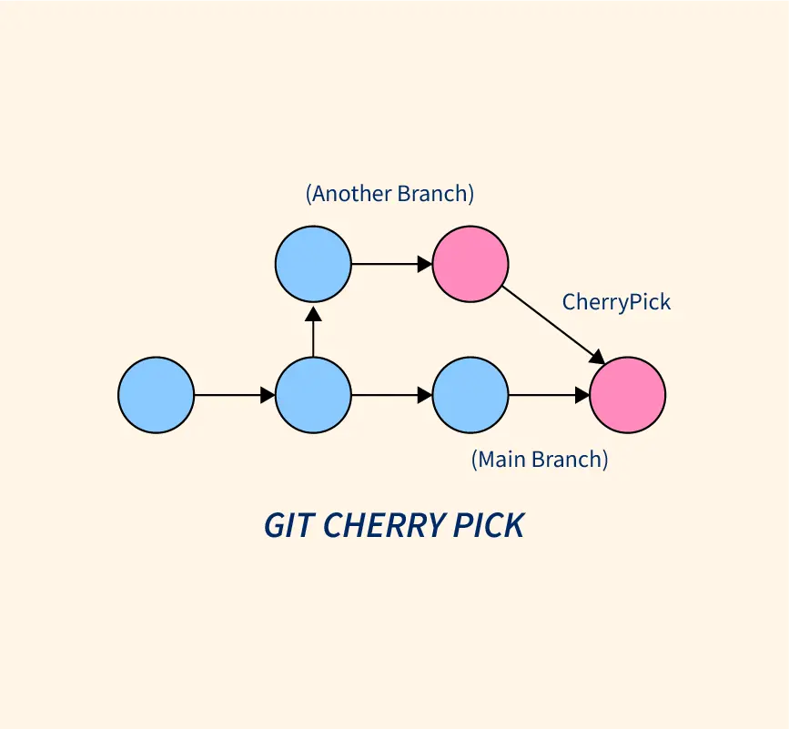

`git init`: initializes a new Git repository in your current directory.

`git clone <repository>`: creates a local copy of a remote repository.

`git add <file>`: stages a file to be committed in the next commit.

`git commit -m "<message>"`: commits staged changes with a message describing the changes made.

`git status`: displays the current status of the Git repository, including any changes that have been made and whether they have been staged or committed.

`git log`: displays a history of all commits made in the repository.

`git log -S “text 2”`: show where all text2 commits have been changed.

`git branch`: displays a list of all branches in the repository.

`git branch <branch-name>`: creates a new branch with the given name.

`git checkout <branch-name>`: switches to the branch with the given name.

`git merge <branch-name>`: merges the branch with the given name into the current branch.

`git push`: pushes the committed changes to a remote repository.

`git pull`: pulls changes from a remote repository and merges them into the current branch.

`git fetch`: fetches changes from a remote repository without merging them into the current branch.

`git remote`: lists all remote repositories associated with the current repository.

`git remote add <name> <url>`: adds a new remote repository with the given name and URL.

`git revert`: creates a new commit that undoes the changes made in a previous commit.

`git revert #hashid`: revert particular changes from the current project.

`git config –global alias.gaac “!git add -A && git commit -m”`: creates an alias for the `git add` and `git commit` commands to make it easier to stage and commit changes.

`git stash`: saves your changes and removes them from your working directory, leaving your directory in the state it was in when you last committed changes.

`git stash save "<message>"`: provides an optional message when stashing changes. This will make it easier to identify the stashed changes later on.

`git stash pop`: applies the most recent stash to your working directory and removes it from the stash list. If you have multiple stashes, you can specify which one to apply by providing its index, like `git stash pop stash@{2}`.

`git branch -vv`: lists all the branches in a repository along with their respective upstream branches and the commit status between them.

`git remote update --prune`: updates your local repository with the latest changes from the remote repository and cleans up any references to remote branches that no longer exist.

`git reflog`: provides a log of all the actions taken on the repository, including commit hashes and the date and time of the action.

`git checkout <commitId> <filename>`: retrieves a specific version of a file from a previous commit. Replace the current version of the file with the version from the specific commit.

`git reset <filename>`: unstages changes to a file that have been added to the staging area.

`git reset HEAD`: unstages all changes that have been added to the staging area.

# Git reset --soft and Git reset --hard

Let's say you have the following commit history:

```bash
A - B - C (master)
```

You're currently on the `master` branch, which is pointing to the latest commit `C`. You realize that you made a mistake in commit `B`, and you want to undo that change.

## Git reset --soft

To undo the change in commit `B` using `git reset --soft`, you would run the following command:

```bash
git reset --soft B
```

This moves the master branch pointer to commit B, and sets the staging area and the working directory to be the same as they were when you made commit B. This means that the changes from commit C are still present in the staging area and the working directory, and you can review them and re-commit them as needed.

```
A - B - C (master)
    ↑
   HEAD
```

To commit the changes from commit C, you would use git commit:

```bash
 git commit -m "Commit message"
```

This creates a new commit that contains the changes from commit C, and updates the master branch pointer to point to the new commit:

```
A - B - C (origin)
    \
     C' (master)
```

Note that `C'` is a new commit with a different commit ID than `C`, because it contains a different history of changes.

## Git reset --hard

To undo the change in commit `B` using `git reset --hard`, you would run the following command:

```bash
 git reset --hard B
```

This moves the `master` branch pointer to commit `B`, and discards any changes in the staging area and the working directory that were made after commit `B`. This means that the changes from commit `C` are permanently lost.

```bash
A - B (master)
    \
     C
```

In this case, the commit `C` is still present in the repository's history, but it's no longer part of the `master` branch. If you want to access the changes from commit `C`, you can check out the commit ID directly, or create a new branch that starts at commit `C`.

---

## Git Merge vs Git Rebase

### Git Merge

`git merge` is used to combine changes from different branches into one. It creates a new merge commit to represent the resulting merge of the branches. The resulting commit history looks like a tree with multiple branches.

Here's an example of a `git merge`:


In this example, we have a `feature` branch and a `master` branch. We want to merge the changes from the `feature` branch into the `master` branch. We run the following commands:

```bash
git checkout master
git merge feature
```

This creates a new merge commit on the `master` branch that represents the merge of the two branches.

### Git Rebase

`git rebase` is used to reapply commits on top of another branch. It creates a linear commit history without any merge commits. It's useful when you want to integrate changes from one branch into another, but you don't want to create a merge commit.

Here's an example of a `git rebase`:


In this example, we have a `feature` branch and a `master` branch. We want to reapply the changes from the `feature` branch on top of the `master` branch. We run the following commands:

```bash
git checkout feature
git rebase master
```

This applies the changes from the `feature` branch on top of the `master` branch, creating a new linear commit history.

### Summary

In summary, `git merge` combines changes from different branches and creates a new merge commit, while `git rebase` re-applies commits on top of another branch and creates a linear commit history without merge commits. Choose the method that best fits your workflow and project needs.

---

## Git Cherry-Pick

`git cherry-pick` is used to apply a specific commit from one branch to another. It allows you to pick and choose specific commits to apply to a different branch.

Here's an example of a `git cherry-pick`:



In this example, we have a `feature` branch and a `master` branch. We want to apply a specific commit (`Commit C`) from the `feature` branch to the `master` branch. We run the following commands:

```bash
git checkout master
git cherry-pick <Commit C>
```

This applies the changes made in `Commit C` from the `feature` branch to the `master` branch, creating a new commit (`Commit C'`) with the same changes on the `master` branch.

`git cherry-pick` is useful when you want to selectively apply changes from one branch to another. However, you should be careful when using `git cherry-pick`, especially if the commit you're cherry-picking has dependencies on other commits that are not present in the target branch.

### Summary

In summary, `git cherry-pick` allows you to apply a specific commit from one branch to another. Use it when you want to selectively apply changes from one branch to another, but be careful when cherry-picking commits with dependencies on other commits.

---

## Git Bisect

Git bisect is a tool that helps you find the commit that introduced a bug or a regression in your code.

To start bisecting, run `git bisect start` in your terminal. Then, mark the current commit as good or bad using `git bisect good` or `git bisect bad`. Git will then check out the middle commit between the two and ask you whether it is good or bad. You continue this process until Git has found the first bad commit.

Here's a visual representation of how Git bisect works:


As you can see, Git bisect works by dividing the commit history in half with each step, effectively narrowing down the search for the first bad commit.

Once Git has found the first bad commit, you can use `git bisect reset` to return to the original state of your repository.

Git bisect is a powerful tool that can save you a lot of time and effort when debugging your code. Give it a try and see how it works for you!
